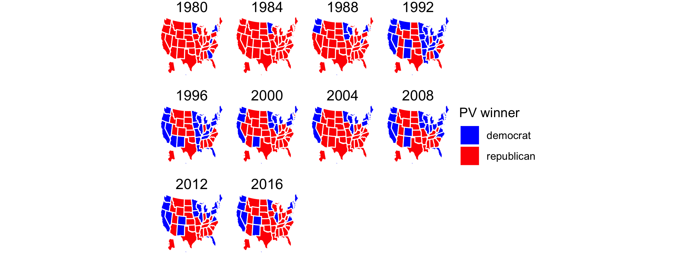

## Introduction
9/13/2020
For this post I worked with two data sets regarding the US presidential elections between 1948 and 2016. Using these data sets, I consider the swing in the two party vote share for the democrats between the 2008 and 2012 elections. 

For this exploration, the two party vote share considers the proportion of the popular vote for either major party (Democrat or Republican) that went to a given party. In using the two party vote share as a metric, we are disregarding votes that went to any candidate other than the two major party candidates. 

We can consider the change in the two party vote share held by the democrats and republicans between different presidential elections in the same state. We can see that some of these swings show trends to the left (i.e. increasing democratic vote share).

