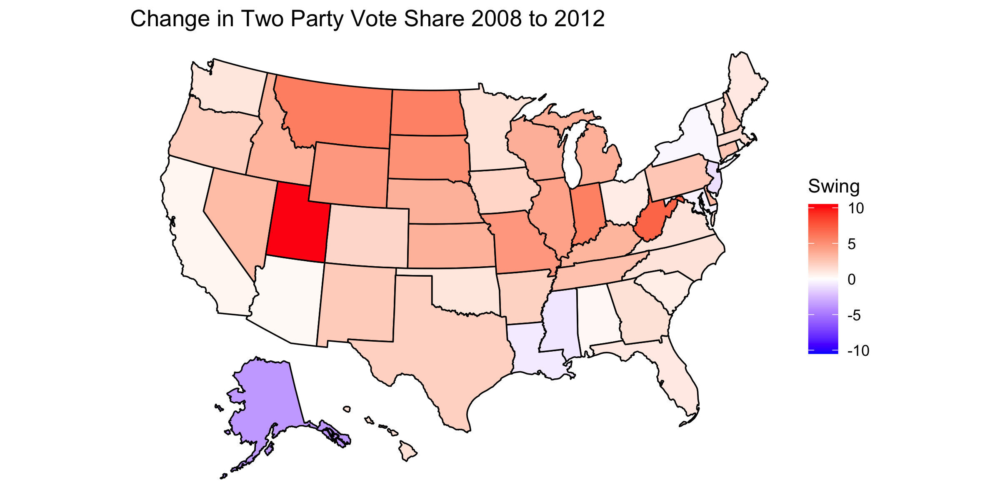

## Introduction
9/13/2020

For this post I worked with two data sets regarding the US presidential elections between 1948 and 2016. Using these data sets, I consider the swing in the two party vote share of Democrats and Republicans between the 2008 and 2012 elections and between the 2000 and 2004 elections. 

For this exploration, the two party vote share considers the proportion of the popular vote for either major party (Democrat or Republican) that went to a given party. In using the two party vote share as a metric, votes that went to any candidate other than the two major party candidates are disregarded. 

We can consider the change in the two party vote share held by Democrats and Republicans between different presidential elections in the same state, which we call the "swing". In both 2008 and 2012, Barack Obama (a Democrat) won the election and in both 2000 and 2004 George Bush (a Republican) won the election. Lets explore how states changed when voting for these two presidents between when they were first elected and when they were ultimately re-elected. 

We can observe how the vote share changed for Obama:

We can also observe how the vote share changed for Bush:

In these maps, a darker blue state indicates a larger swing towards the Democratic Party and a darker red state indicates a larger swing towards the Republican Party. Thus, for the plot indicating the '08-'12 swing, darker red states indicate states where Obama acquired a lesser share of the two party popular vote in the state and in the plot of the '08-'12 swing, darker red states indicate states where Bush acquired a greater share of the two party popular vote in the state. This color choice was made to be consistent with the colors conventionally assigned to the parties. It is important to note that the color indicates the swing and not the victor; the color of the state has no implications as to which party won the popular vote in that state.

# Analysis of Swing Maps

From the map of the swing between the 2008 and 2012 presidential elections, we can observe that Obama tended to do have swings that did not go in his favor. This is not particularly surprising given that Obama's national two party popular vote share decreased from 52.8% in 2008 to 50.9% in 2012. While the map makes no causal claims about why there were such swings, we can speculate what caused them. Since most states show only a modest adjustment in the two party vote share, it seems that the change in public opinion of Obama was driven by factors that were not especially state specific. The notable outlier of Alaska can be explained by the fact that in 2008 the Republican Vice Presidential candidate was the Governor of Alaska, so in 2012 Republicans had a worse showing because this state bias was removed. The outlier of Utah can be explained by the fact that the Republican candidate in 2012 was Mormon and Mormons compose a particularly high proportion of the population in Utah.

From the map of the swing between the 2000 and 2004 presidential elections, we see greater variety in the swing for Bush than for Obama. On a whole, Bush did better in the national two party popular vote in 2004 with 50.6% of the two party popular vote as opposed to only 47.6% in 2000 (where he won with a minority of the popular vote). The variety of swings suggests that the motivation of the swing tended to vary considerably by state. One state for which we can attempt to explain the swing is Tennessee; in '00 Bush's opponent was from Tennessee so, in the absence of that bias, Tennessee was more inclined to vote for Bush.

# Pie Charts

When considering these two swing scenarios, we can also consider whether the swings made the state popular vote closer between the two parties or less closer. The pie charts below show the proportion of states in which the margin of victory was made smaller or larger between the two relevant elections.

From these two plots we notice that despite the fact that there were many swings to the Republicans from '08 to '12 and a mix of swings in both directions between '00 and '04, in both cases the swings resulting in a roughly even proportion of states becoming closer and less close of an election. This has the consequence that as some states become less competitive, other become more competitive.

# Significance

As the 2020 election approaches, Donald Trump seeks to gain re-election as President Obama and President Bush did before him. This observational exploration of the swings for Obama and Bush, in light of the fact that both were re-elected, emphasize the fact that Trump's path to victory -when viewed through the lens of swings- can be varied. From Obama's swings, we note that not necessary that Trump acquire large swings in his favor since his 2016 election. From the Bush swings, we note that while Trump lost the popular vote in 2016 it is possible that he acquire a majority of the national popular vote in 2020. This these qualitative considerations in mind, we can begin to consider how we can assess what sort of result we expect to to occur in the 2020 presidential election.