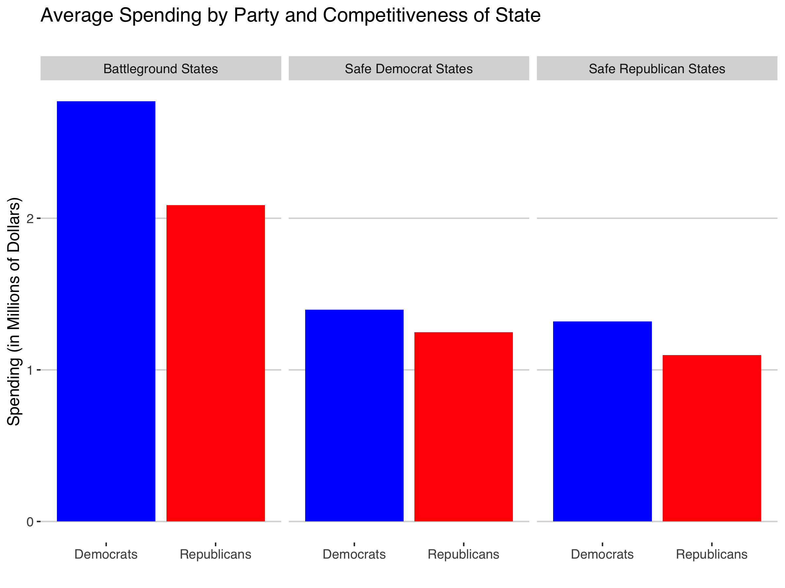
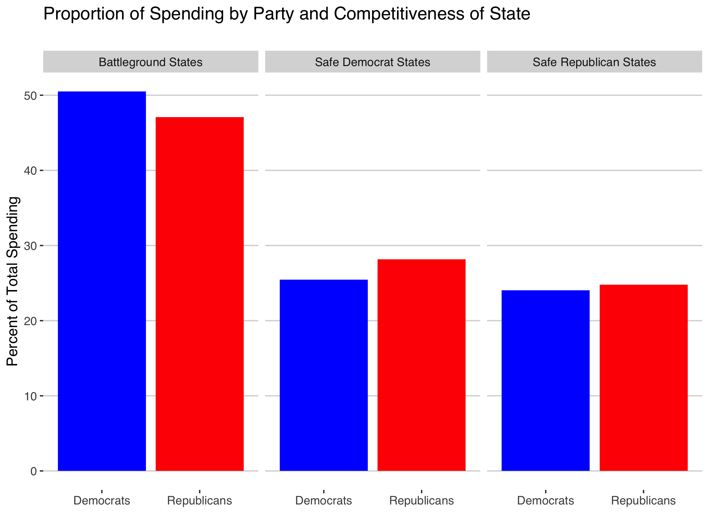
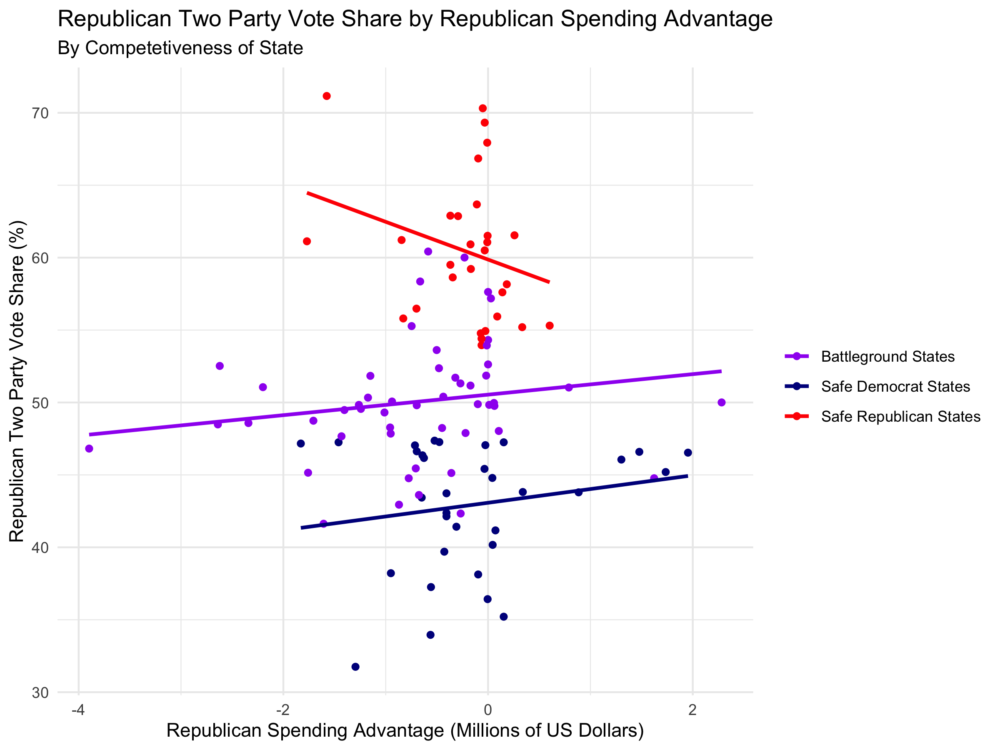

## The Air Game

10/11/2020

In this post I explore the effect of advertising on the US Presidential Election. I will use data on **money spent on advertising** by presidential candidates to predict **two party vote share** for the major party in battleground states and I will use those results to make a ***prediction about the electoral result in 2020***.

# Relevant Considerations

For the sake of this exploration I confine myself to money spent on advertising in the month of **September**. This is because this is advertising data closest to the election that I have access to. It has been argued that the effects of advertising are significant, but decay rapidly over time. Thus, *restricting myself to only the advertising closest to the election* (for which I have data) should be a fairly reasonable choice.

In a given election, not every state can reasonably be considered to be competitive. We might expect that spending in states that are not competitive will not have a significant impact on the result in those states. For this reason, **I separately consider the effects of advertising on** ***safe democrat states, safe republican states, and battleground states***. I create these categories by taking all states deemed "swing" states in the federal funding data set to be battleground states, and any state decided by less than a 5 point two-party popular vote margin to be a battleground state. For non-battleground states, I categorize "safe democrat" and "safe republican" by retroactively *observing the winner* and taking that result to have been "safe".

Based on constraints on available data about money spent on advertising, I only consider historical data from the **elections from 2000 to 2012**. This is unfortunately a small data set and therefore limits the predictive power of my analysis.

# Historical Trends in Spending 

First we can consider where campaigns spend their money. Below I plot the **average amount of September spending by each party in each category of state competitiveness**.

## Analysis of Plot
In this plot we observe that in election from 2000-2012, Democrats have spent more money than Republicans in all three categories of states. We also observe that **campaigns spend more money in battleground states**. This is not surprising when we consider that these are the states in which they have the best opportunity to influence voters in a way that influences the ultimate election result.

We can also consider how this plot looks if we adjust for the Democrats absolute spending advantage by considering the *proportion* of campaign spending that is allocated to each category of state.

## Analysis of Plot
Here we observe that Democrats have spent proportionally more of their advertising money in battleground states, though the difference is not large enough to be significant. In general, we see that **parties tend to give about half of their advertising money to battleground states** and about a quarter of their advertising money in safe states for each party.

# Using Historical Data to Predict 2020

For the safe states, we see that the data varies drastically in terms of two party vote share for similar differences in advertising spending. This tells us that *it is not useful to consider a regression line in the "safe" categories*. This is not consequential for our predictions because we can already reasonably assume which candidate wins the state so it is unnecessary to know a point estimate for the two party vote share. Because of this, I attribute the negative slope of the regression line of republican safe states to the fact that there is so much error in the regression line that the sign of the slope cannot reasonably be determined. This suggests that differences in advertising spending are exceptionally bad predictors of two-party vote share in "safe" states. 

In battleground states we observe the intuitive trend that **a bigger spending advantage correlates with a larger two-party vote share result**. This means that more advertising by a given party in these states tends to improve the result for the party.

We also observe, however, that when Republicans and Democrats match each others' spending in a battleground state, the Republican tends to do slightly better. This seems to counterbalance the fact that Democrats tend to outspend Republicans in the elections since 2000. This observation is not especially powerful because it is within a reasonable margin or error of having a tied two-party vote share when spending is equal between parties.

The regression line for battleground states has a very low r-squared value. This means that **difference in campaign advertising spending is not a strong predictor of two party vote share**. Despite this, for the sake of exploration I will use the regression line in battleground states to predict the 2020 electoral results.

# Prediction

For 2020, I have data on the number of airings by each candidate in each state in September and I have the total spending on advertising by the two candidates in that time period. I assume that we can roughly approximate the amount of spending by each candidate in this time period by *taking the cost per airing to be the same for each airing*. While this is certainly not true, it is likely to give reasonable information about the relative amounts of spending by each candidate.

For "safe states", I do not use a regression line and simply **assign their electoral votes to the candidate of the party for which it is deemed "safe"**. For battleground states, I use the **spending data for September 2020 and my regression line** from the historical data to predict the two-party vote share and therefore the winner of the electoral votes in each battleground state. Here are the results:

My personal impression of this prediction is that it is, for the most part, reasonable. I am skeptical that Trump would win New Hampshire while losing battleground states like Pennsylvania and Florida because I suspect New Hampshire is a battleground state that Biden is more likely to win because of it's similarity to "safe" democrat states like MA and VT. NH could be blue once we account for the error in the regression line, but using the regression line I predict Trump winning NH.

# Conclusion
Using data on advertising spending in September, I generate the following prediction for the 2020 electoral result:

|--------------------------|------
| Trump Electoral Votes    | 208  
|--------------------------|------
| Biden Electoral Votes    | 330  
  
Thus, ***my prediction gives that Biden will win the 2020 Presidential Election***.