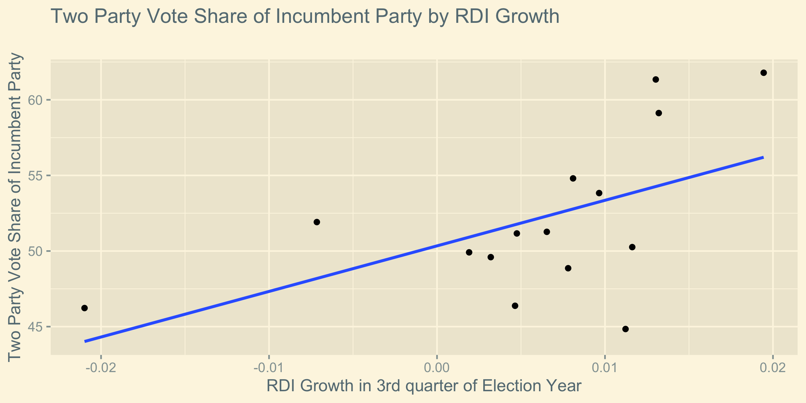
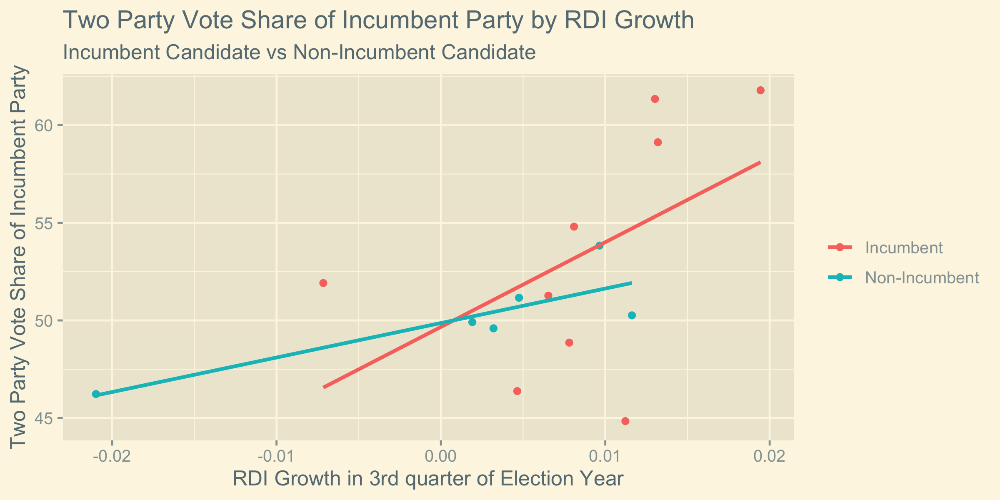
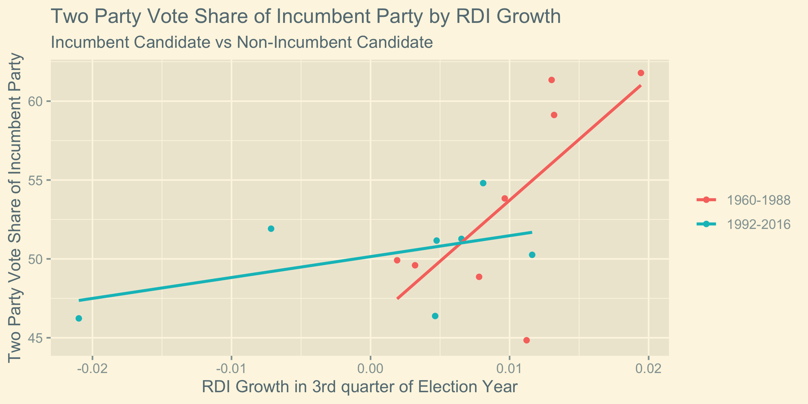

## Economy

9/20/2020

# Explanation of Post

In this post I explore the effect of the economy on the result of the US Presidential elections. In particular, I consider the effect of **growth of real disposable income (RDI) in the third quarter of an election year** on the percentage of the **two party vote share acquired by the incumbent party**. *The intention of this investigation is to use the linear trend supplied by this data to predict the two party vote share for Donald Trump in the upcoming 2020 election.*

Beyond the regression generated by RDI growth, I considered whether the impact of 3rd quarter RDI growth had different impacts for candidates that were **incumbent** presidents seeking re-election and **non-incumbent** candidates of the incumbent party.

I also considered whether the election predictions differed if we only considered more recent elections or less recent elections. Since I had RDI growth data dating back to 1960, I define *"more recent"* and *"less recent"* elections such **elections from 1992 to 2016 are "more recent"** and **elections from 1960 to 1988 are "less recent"** to have roughly even subsets of the data in each category.

# Motivation for Model

There is [significant evidence](https://onlinelibrary-wiley-com.ezp-prod1.hul.harvard.edu/doi/pdfdirect/10.1111/ajps.12053)[^1] that voters (often unknowingly) weight the most recent economy much more heavily than previous economic trends within the term of the sitting president. This effect happens even when voters intend to equally weight the entire scope of the previous presidential term. To account for this recency bias, I consider 3rd quarter data because that is the most recent economic data available to the electorate at the time of the election.

I chose to consider the economic indicator of **RDI (real disposable income)** rather than other possible indicators such as GDP because it seems that RDI would have a more noticeable impact on a voter's life[^2]. 

# Implementation of Model

First, we can consider the trend given by RDI growth.

Now, we can consider how this trend differs when we consider the separate cases of a incumbent and non-incumbent candidate for the incumbent party.

Finally, we can consider how this trend differs when we consider the separate cases of more and less recent elections as defined above.

# Analysis of Trends in RDI Growth Based Models

We observe that in all cases the slope of the regression line is positive. This can be interpreted as indicating that **as RDI increases more, the incumbent party is expected to acquire a large portion of the two party vote share**. This trend matches our intuition because it means that as voters have a more positive economic experience near the election, they are more likely to vote to keep the party that gave them that positive economic experience.

We also observe that **RDI growth has a greater impact on an incumbent president than a non-incumbent**. This trend seems to make sense because it means that voters associate the economy right before the election to reflect more heavily on the incumbent themself than the incumbent's party in general.

Furthermore, we observe that **in more recent elections RDI growth has a smaller impact on the incumbent party vote share than in less recent elections**. This may be the result of greater availability of economic data in more recent elections which allows voters to weight other factors (such as non-3rd quarter factors) more heavily than they otherwise might have be inclined to. This interpretation is consistent with the fact that the "more recent" regression fits the data more closely than the "less recent data" (as assessed by the r-squared values) which means that the variability in the trend can be better accounted for by RDI growth in "less recent" elections.

# Prediction

We can consider the proportion of the two party vote share we expect Donald Trump to get based on these models. However, RDI growth data for 3rd quarter of 2020 is not yet available. Thus, for the sake of prediction, we must first speculate what the RDI growth might be for the 3rd quarter of 2020. (Once the data becomes available, it is possible to update our prediction with that data, but for now we must speculate.) We know that the [RDI growth in July was -0.1%](https://www.bea.gov/news/2020/personal-income-and-outlays-july-2020#:~:text=Disposable%20personal%20income%20(DPI)%20increased,(tables%205%20and%207).). **Since we don't have more recent RDI growth data, we will use the data from July as a proxy for the third quarter**. This may ultimately be a poor assumption, particularly given the economy volatility due to the coronavirus, but in the absence of more data, this will form the basis of my prediction.

| Model                    | Trump's Predicted Vote Two-Party Vote Share  | Margin of Error
|--------------------------|----------------------------------------------|----------------
| Simple RDI Growth        |                  20.2%                       |30.6%
| RDI Growth by Incumbency |                   6.3%                       |73.0%   
| RDI Growth by Recency    |                  36.9%                       |28.6%     

Ultimately the predictive power of this model is not especially strong as evidence by the large margin or error for the predicted two-party vote share. 

Furthermore, we can expect that -even if the predictive power of the model was generally very strong- the fact that coronavirus is causing unprecedented 

[^1]: [Healy and Lenz, 2014] Healy, A. and Lenz, G. S. (2014). Substituting the End for the Whole: Why Voters Respond Primarily to the Election-Year Economy. American journal of political science, 58(1):31–47.

[^2]: I also found that if I adjusted my model to use economic variables other than RDI (such as GDP growth and unemployment percentage) the model was less effect at accounting for the variation in the incumbent vote share than an RDI growth based model as evidenced by q lesser r-squared value for its regression line.