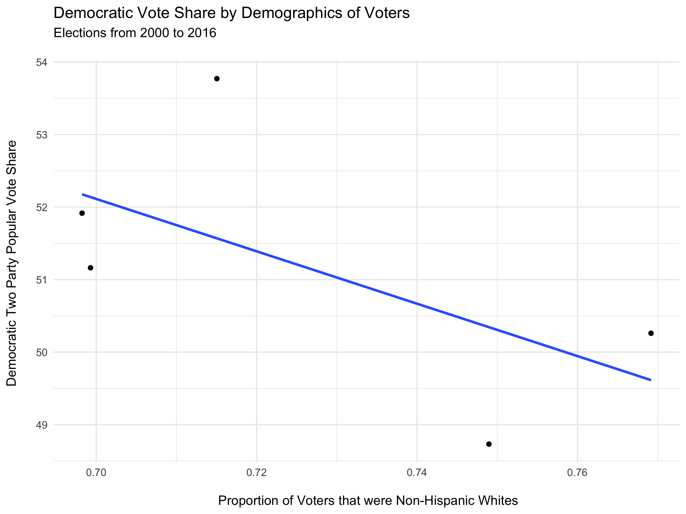

## The Ground Game

10/18/2020

The *Ground Game* of a campaign includes all of the targeted efforts to appeal to specific individuals. The most commonly considered "ground game" factor is the presence of field offices and volunteer campaign workers that go door to door talking to people. Ground game efforts can be assessed on two metrics: how well they **persuade** people to vote a certain way and how well they **motivate** people to vote. Studies have found that the **ground game is more effective at motivating people to vote than it is at persuading people to change their vote**.

# Voter Turnout
Considering that **the ground game can have a impact on voter turnout**, it is worth considering how voter turnout can influence the result of an election. For this exploration I will restrict myself to **battleground states**. For states where the election is not competitive, the turnout will not determined the result so it is not meaningful to consider safe states. 

I will look at the results and the turnouts in **battleground states in elections from 1980 to 2016**. I define battleground states as states determined by less than 8 percentage points in two party popular vote share. This definition was chosen because in states in which the election was not decided by large margins, one could imagine that a significant shift in the number of voters could change the result of the election.

Let's consider how the voting turnout affects how often Democrats win in a battleground state.

Here we see that **when the voter turnout gets higher, Democrats tend to win more consistently**[^1]. This means that we expect that the Ground Game and "get out the vote" initiatives could be especially important to Democrats. With this in mind, it is not very surprising that in recent elections Democrats have had a much larger Ground Game presence than Republicans.

# Turnout by Demographic

In addition to considering how many people vote (as a percentage of the voting eligible population), we can consider whether the demographic composition of the voters impacts the result of the election. I will consider how **racial demographics of the voters** affect the **national two party vote share** in the election. 

This result is contrary to what we would have expected. The plot suggests that a higher proportion of white voters benefits Democrats. Statistically, non-white voters have been found to vote more frequently for Democrats. We can attribute the counter-intuitive result in the plot to the fact that the trend-line does not capture the data very well (r-squared of .08). We can see the way in which **this line is not robust** by removing the elections in 1992 and 1996 and finding the trend:

Since we observe that the slope of the regression line is negative, we see a trend that matches what we would expect: **a greater share of non-white voters, tends to give a greater two-party vote share for Democrats**. This trend line has an r-squared value of .37, so in principle it captures the data better than the regression line in the previous plot. Having said that, since there are so **few data points available**, we would not expect this plot to have a lot of predictive power about other elections.

# Prediction

Turnout data is not the most useful variable for making predictions about an election result because **in order to predict an election based on turnout, you first need to predict turnout**. This, naturally, entails its own set of difficulties.

For this reason, I am going to make my prediction as a follow up to [my previous blog post considering polling](polling.md). In this previous blog post I made an electoral prediction based on current **national polling data**, current **state level polling data**, and the amount of **time until the election**. Since it has been about a month since I used this model to make a prediction, I am going to update my prediction using the same model and the most recent relevant polling data.

Recall that my model was:

***Electoral Prediction = (10 - months until election)/10 * State Poll Prediction+ (months until election)/10 * National Poll Prediction***

I acquired recent polling data (as of 10/17/2020) from [FiveThirtyEight](https://projects.fivethirtyeight.com/polls/president-general/national/). The current state polling suggests that the electoral map will be:

However, the **national popular vote would suggest a closer result** since the current polls give: 

| Candidate | National Popular Vote Polling |
|-----------|-------------------------------|
| Trump     | 41.8%                          |
| Biden     | 52.4%                          |

Using my model to put together these considerations I predict that the final electoral counts will be:

| Candidate | Predicted Electoral Vote |
|-----------|--------------------------|
| Trump     | 188                      |
| Biden     | 370                      |

Therefore, ***I predict that Biden will in the 2020 US Presidential Election.***

[^1]: With that said, research by the [New York Times](https://www.nytimes.com/2019/07/15/upshot/2020-election-turnout-analysis.html) suggests that the Democratic advantage of a high voter turnout may not be so clear cut in the 2020 election due to demographic differences in different battleground states.

