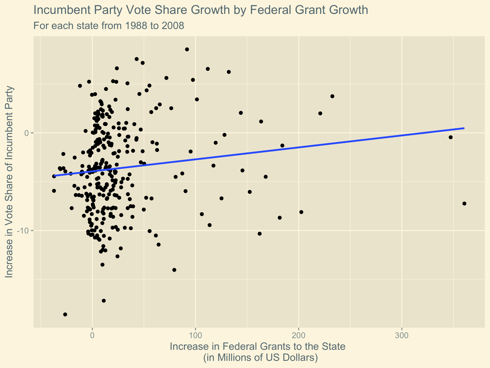

## Incumbency

10/4/2020

There are often **perceived benefits for incumbents** in US Presidential elections. As a sitting president with the ability to run in the following election, a candidate has the ability to make decisions that affect where federal money is spent. We might expect, therefore, that Presidents that intend to run for reelection will be **strategic in their efforts to direct government funding** to curry favor with voters in key states. 

In light of this, in this blog post I consider how federal spending could be used to predict the result of the election. In particular, I will compare the ***change*** **in federal grants** spent in a given state and the ***change*** **in popular vote share earned by the incumbent party** between consecutive election cycles in that state. 

I consider how this trend differs when the **incumbent party is the Democratic Party versus the Republican Party**, how this trend differs for **incumbent candidates of each party**, and how the trend differs for states considered **swing states as opposed to safe states**. (Note that a swing state is a state that is thought to be competitive between the two major parties and a safe state is any non-swing state. The swing states may change between different election cycles.) 

# Plotting the Trends
First we consider the overall trend *comparing the change in the federal grants spent in a state and the change in the two-party vote share acquired by that incumbent party since the previous election cycle.

Now we can consider how this trend differs when the incumbent president is a Democrat or a Republican. (Note that in this plot, I do not consider whether the sitting president is running for reelection.)

Now we can consider how this trend differs between swing states and non-swing states.

# Interpretting the Plots

In the first figure, we observe that in general a greater increase in federal spending in a state results in a greater increase in the two party vote share of the incumbent party in the state. This result is consistent with our expectation: voters respond positively to the incumbent party in response to money spent in their state.

In the second figure, however, we see that the same increase in federal funding results in a greater increase in two-party vote share for Democrats than it does for Republicans. We can attempt to explain this by considering that the Democratic Party is known as the party of governement spending moreso than the Republican Party. Because of this, voters might be more prone to attribute increased spending in their state to the Democrats than they would be for Republicans. This would explain why the regression line is steeper for Democrats than for Republicans.

Finally, in the third figure we see that the same increase in federal funding results in a lesser increase in incumbent two-party vote share for a swing state than for a non-swing state. We can explain this by considering that more campaign efforts are focused in swing states because that is where the election is ultimately decided. In the presence of other pressures supplied by the campaigns, the federal funding is a smaller piece of the factors that influence voters in a swing state than in a safe state where there is less campaign activity. Because of this, we see that it makes more money to see the same effect on the voter in a swing state. 

# Limitations

For all of the regression lines, the fit to the data is exceptionally weak. This means that there is a high probability for data to deviate from this trend. In other words, **the relationship does not have a lot of predictive power**. Also, the data used to generate these trends only spans from 1988 through 2008 which is a fairly small sample, making it harder to extrapolate with confidence. Additionally, with the large amounts of federal spending due to the coronavirus, it is possible that **the virus supplies a confounding variable** that will limit the extent to which the incumbent is rewarded for the allocation of federal funds to the states.

In summary, any prediction made using these trends cannot be expected to forecast the election with great accuracy.

# Prediction
Although we do not have a great basis for making a prediction from these trends, we can consider what result we would expect given these 

# Conclusion
In conclusion, since change in federal spending is not strongly correlated with change in two-party popular vote share, it is not very reasonable to use federal spending as a predictor for the 2020 US presidential election. As such, the prediction I made last week [using polling data](polling.md) remains a much more reasonable basis for predicting the election.