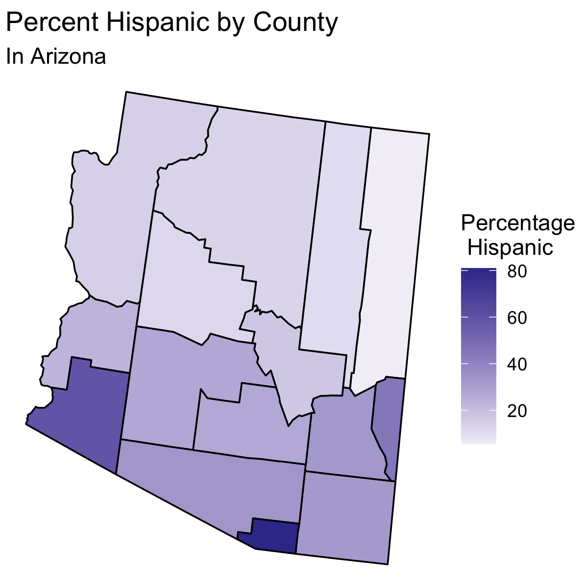
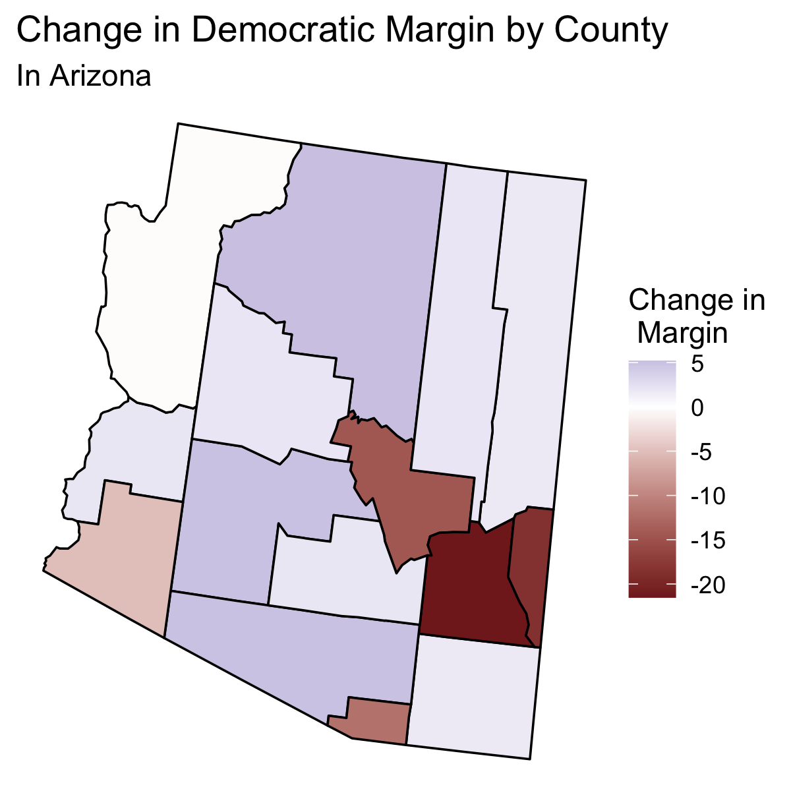
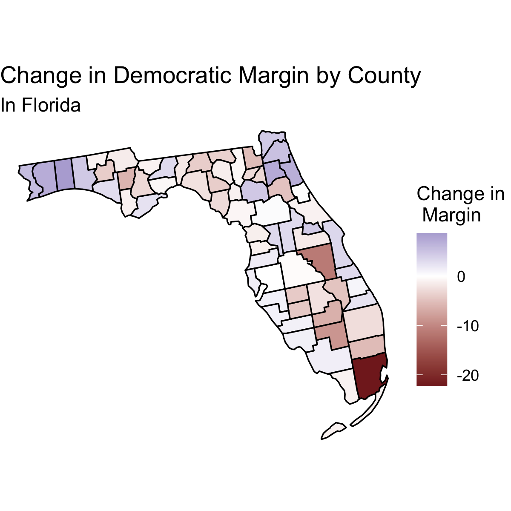

## Media Narratives

12/10/2020

# Hispanic Voters and the Media

# The Data

# The Implication

Elections are decided on the margin. We saw that Donald Trump won in 2016 but lost in 2020. A good way to consider  

# Ecological Fallacy

Currently, we do not have complete data on voting percentages for each candidate broken down by demographic. This means that in order to consider media narratives about Hispanic voters, we must make inferences based on county data and demographic data about the county. This has the risk of **ecological fallacy**. This means that we may wrongly attribute the effect we see on a county level to a particular subset of the voting population without confidence that this subset is indeed the driving cause.

In other words, while we can make inferences about the behavior of Hispanic voters based on the data we have, we cannot fully confirm or deny media narratives about Hispanic voters without data on how these people voted. 

# Testing the Implication

## Nationally

## Populous States

## Close States

# Qualitiative Visualization

## Arizona

 

## Florida

 

## Texas

 

# Conclusion

# Thank You

This blog post marks the end of my work for Harvard government course 1347. I would like to think Professor Enos and TFs Sun Young Park and Shoubik for all their work this semester and the help they have given me in analyzing the 2020 election.

