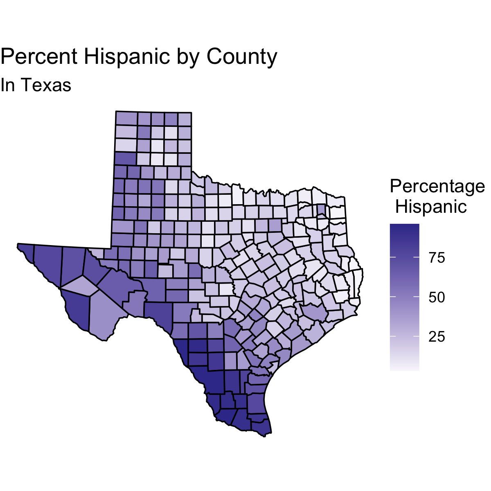
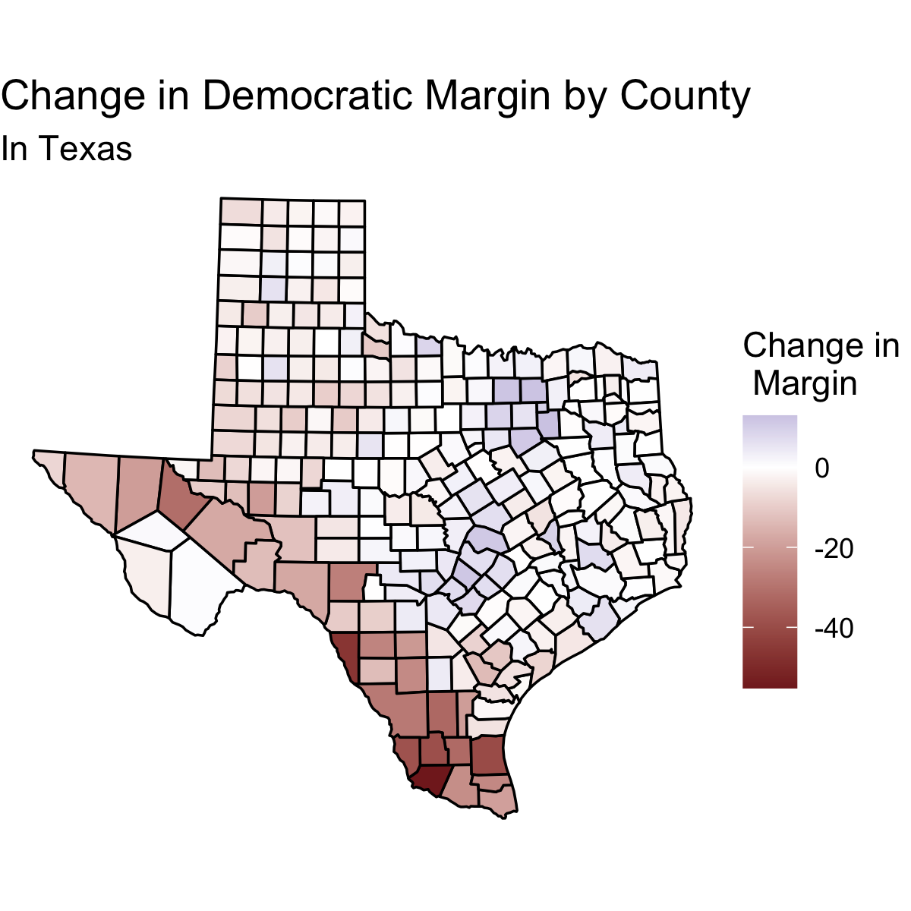

## Media Narratives

12/10/2020

# Hispanic Voters and the Media

After an election, the media tends to construct narratives about why the election turned out the way it did. These narratives tend to be made based on observations that are *not particularly rigorous or data driven*. In this blog post, I explore one such media narrative from the 2020 election.

The media has made many claims about the role of the Hispanic and Latinx voters. These narratives make different claims about [young voters in this demographic](https://www.nbcnews.com/news/latino/young-latinos-mobilized-voted-were-pivotal-2020-organizers-want-keep-n1246853) and about [how much Hispanic voters are actually a unified voting block](https://www.cnn.com/2020/11/09/politics/latino-voters-florida-texas-arizona/index.html). The upshot of these various claims is that the media is claiming that Hispanic voters were an especially important group in the 2020 election based on the way they voted. In other words, **there is a media narrative that Hispanic voters were pivotal in the 2020 election.**

# The Data

To explore this media narrative, I will be using the county by county results from the 2020 election [^1]. I also I have the margin (in percentage points) in each county in the 2016 election. Combining these two data sets, I will be compare the margin between Republicans and Democrats in each county to find the **change in the Democratic margin from 2016 to 2020**. The fact that I am considering the *Democratic margin* simply means that if the Republicans performed better in 2020 than 2016 the value will be negative. 

In terms of demographic data, I have information about the **demographic composition of each county in 2016**. In particular, know the percentage of the population that is Hispanic in each county. I do not have this data for 2020, but I can reasonably assume that the 2016 data is a suitable proxy for this data. I also have the **demographic breakdown of each state** from 2016.

Just to verify, in a simple way, the data I am working with is accurate, we can check to make sure the the result in each state matches the actual election results:

We observe that all of the states accurately describe the election (with the exception of Alaska which I do not have data for). Thus, the data seems accurate.

# The Implication

Elections are decided on the margin. We saw that Donald Trump won in 2016 but lost in 2020. This means there must have been some change in how people voted, which may have resulted from shifts in entire demographics of people. 

In order for Hispanic voters to have been pivotal as the media narrative tells, **we would expect Hispanic voters, as a group, to show a voting pattern that is stronger than other demographic groups**. This means that *in counties with a greater proportion of Hispanic voters we expect the trend to present itself more*. Thus, **the media narrative that Hispanic voters were pivotal has the implication that counties with higher percentage Hispanic people will show greater change in voting margin between 2016 and 2020.**

Ideally we would have the data on how different demographic groups voted specifically. However, as I do not have this data, I must consider a trend I would expect to see based on county level. This is why I will consider **the relationship between the percentage of the population that is Hispanic and the change in the margin of victory** for each county.

# Ecological Fallacy

Currently, we do not have complete data on voting percentages for each candidate broken down by demographic. This means that in order to consider media narratives about Hispanic voters, we must make inferences based on county data and demographic data about the county. This has the risk of **ecological fallacy**. This means that we may wrongly attribute the effect we see on a county level to a particular subset of the voting population without confidence that this subset is indeed the driving cause.

In other words, **while we can make inferences about the behavior of Hispanic voters based on the data we have, we cannot fully confirm or deny media narratives about Hispanic voters** without data on how these people voted. Thus, the results of my exploration in this post will either *support or oppose* the media narrative, rather than *confirm or deny* it.

# Testing the Implication

## Nationally

To test the effect of Hispanic Voters, I can plot the change in the Democratic margin from 2016 to 2020 against the perentage of the county population that is Hispanic.

From this plot 

Since the presidential election is decided state by state, we can consider how the this trend decomposes on a state by state basis. I plot the same trend broken down for each state.

In this plot we see that many of the states have relationships very close to horizontal. These relationships suggest that, at least in these states, the media narrative does not describe the election well. However, some of these states do show a notable slope. I will now consider some states more closely.

## Populous States

Since we are looking for evidence for or against the media narrative that Hispanic voters are pivotal, it is important to pay particularly close attention to states with large Hispanic populations (by percentage) because Hispanic voters will be more prone to indeed swing the result of the election. These are the states with the largest 

We can now take a closer look at the trends in these states.

## Close States

Since we are considering whether Hispanic Voters were pivotal, it is also especially important to consider states with close results because in these states, although there may not be a large Hispanic population, **it does not take as many votes to flip the result**. 

In this plot we see that these states have weak relations with slightly positive slopes. This means that in counties with greater Hispanic proportions Democrats tended to do better in 2020 than 2016. However, since these trends are not pronounced

# Qualitiative Visualization

## Arizona

Below I show the percent of each county that is Hispanic and the change in margin in each county in Arizona.

 

In these maps, we can see qualitatively what we saw above in the plot for Arizona of the change in the Democratic margin vs the percent of the population of the county that is Hispanic: **there is no strong** trend. If we look at the counties with larger Hispanic percentages (darker purple) we do not see a trend in the change shown in the following map. Therefore, **Arizona data opposes the media narrative that Hispanic voters were pivotal**.

## Florida

Below I show the percent of each county that is Hispanic and the change in margin in each county in Florida. 
 

These maps of Florida support the media narrative. Qualitatively, we see that counties with large Hispanic populations (dark purple in first map) tend to show large negative shifts in the margin (darker red in second map). This means that there is evidence that suggests that Hispanic voters were pivotal in making Florida more Republican than it was in 2016.

## Texas

Below I show the percent of each county that is Hispanic and the change in margin in each county in Texas.

 

From these maps, it seems that Texas also supports the media narrative. Counties with large Hispanic populations (dark purple in first map) tend to show large negative shifts in the margin (darker red in second map).

# Conclusion

Ultimately I found more evidence that Hispanic voters were unpredictable than that they were pivotal. In certain states this demographic certainly seemed to be pivotal 

States that supported the media narrative tended to have negative slopes. This means that when Hispanic voters were particularly impactful in changing the election result in 2020 as opposed to 2016, they tended to vote Republican. However, this may be due to the fact that counties with high proportions of Hispanic voters voted very Democratic in 2016 and thus did not have as much ability to shift dramatically to be more Democratic. 

# Thank You

This blog post marks the end of my work for Harvard government course 1347. I would like to think Professor Enos and TFs Sun Young Park and Soubhik Barari for all their work this semester and the help they have given me in analyzing the 2020 election.

[^1]: I do not have county results for Alaska in 2020, but even without this data I can reasonably explore trends in the county level data, particularly as Alaska was not especially competitive and it does not have a particularly large Hispanic population.