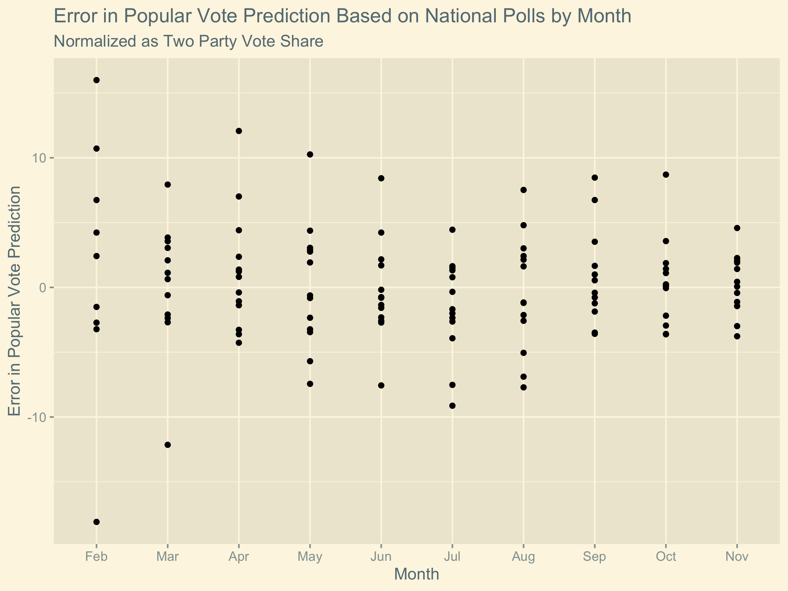
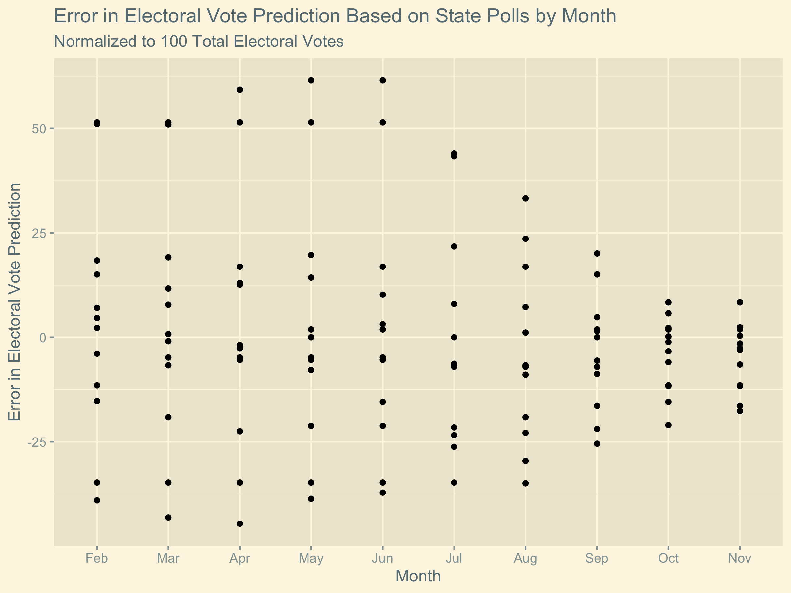

## Polling
9/27/2020

In this post I consider whether ***National*** **or** ***State*** **level polling** yields a more accurate prediction for the US presidential election. Based on the results of this investigation, I create a prediction for the 2020 presidential election used a weighted combination of state and national level polling.

# Gaps in the Data
Pollsters do not take polls in every state in every month of every election year. Thus, in order to compare how accurate polling data is by month, it is necessary to assign an expectation to each month in which a poll is not taken. To this end, I made the following choices:

  * If a poll was not taken in a given month in a given state but a poll was taken in that state in a previous month of the same election cycle, then I assume that the situation is the same as that **most recent polling data**.
  * If there have been no polls in a given state for a particular election cycle, I assume the state will vote similarly to how it voted in **the previous election**.
  
Both of these choices were made with the idea that -in the absence of more recent data- using the **most recent data is the best available proxy**.

# Electoral Votes vs Popular Votes
When considering the result of a US presidential election, we can consider either the electoral vote counts resulting form the way states contribute to the overall result or we can consider the two party vote percentage acquired by each of the major parties. While two party vote percentage is simpler to work with, the electoral votes is what ultimately determined the winner of the election.

To account in part for the impact of the electoral college in distorting the election results, I *normalize* the difference in electoral vote count as if the total number of electoral votes is 100. This makes the plots more reasonable to compare because two party popular vote share is constrained so that the total percentage of votes is 100%.

However, this normalization is not a perfect solution to comparing **electoral votes** and **two party popular vote share**. In general, the electoral college distorts the results of elections. Since each state is winner take all, *a small difference in votes in one state can be magnified into a large change in the electoral college* if it changes which party wins the state. This increased volatility of electoral college focused predictions means we expect a larger errors when considering electoral vote projections than when considering two party popular vote predictions.

One might ask why we bother to consider electoral predictions at all instead of also using the state polling to predict national two party vote share. While this would allow for easier comparison of the two types of polling data, since the **electoral college is ultimately what determines the presidency** (not the popular vote share), it is more important to know what this electoral college result will be. As such, I chose to consider the electoral vote counts at the expense of some cleanliness of comparison.

# Plots

First we can consider the predictive ability of the national popular vote polling. I use **month-by-month polling data** (from February to November) in each election year from 1968 to 2016. For each month I consider the ***difference*** in the *two party vote share for Republicans suggested by the polled support rates* for the two major parties and the *actual portion of the two party vote share* that went to Republicans in that election year. (The choice to show the difference for Republican instead of Democrats has no consequences because we assume that all votes and electoral votes must go to one of these two parties.)

We can similarly consider the predictive ability of the state polls by plotting the ***difference*** between the *electoral college result suggested by which candidate is leading in polls each state* and *the actual electoral college result* from that election year. (As with the national polls, I consider this difference for Republicans but this is simply the additive inverse of what it would be for Democrats.) 

# Analysis of Plots
We observe that **when the election is far away, national polling gives a better indication** for who will win the election and **when the election is close, the state polling gives a better indication** of who will win the election. Over time the national polling data converges on the correct two-party vote, but it does not converge very much. In contrast, long before the election, the state polling does not give a very good prediction of the result, but it converges dramatically as the election approaches. This result is likely the result of the distortion caused by the electoral college system. Since a candidate can lose the election with a higher two-party vote share, *the* ***location*** *of the votes they earn is highly relevant in addition to the quantity*.

# Model
Based on the results of our analysis, we see that we should increase the weighting we give to state polls as we get closer to the election. From this concept we can create the predictive model:

***Electoral Prediction = (10 - months until election)/10 * State Poll Prediction+ (months until election)/10 * National Poll Prediction***

In this equation, "State Poll Prediction" indicates the number of electoral votes predicted by the state polling data for a given party. (This number is out of 538, not normalized to 100 because we will normalize the national popular vote to 538.) "National Poll Prediction" is the number the number of electoral votes a candidate would get if their two party vote share in the national poll converted proportionally to the 538 electoral votes.

This scheme means that while data about the election that would give us precision in our prediction (namely state polling) is unavailable, we use broader information about the electorate to qualify our expectation and as thorough state polling developing we reduce our reliance on national polling (which is not especially predictive on a margin necessary to predict the election).

# Prediction

I acquired recent polling data (as of 9/27/2020) from [FiveThirtyEight](https://projects.fivethirtyeight.com/polls/president-general/national/). ***Based on this data, my model predicts that Republican candidate Donald Trump will earn 199 electoral votes.***
This would mean that **Democratic candidate Joe Biden would win the presidency**.