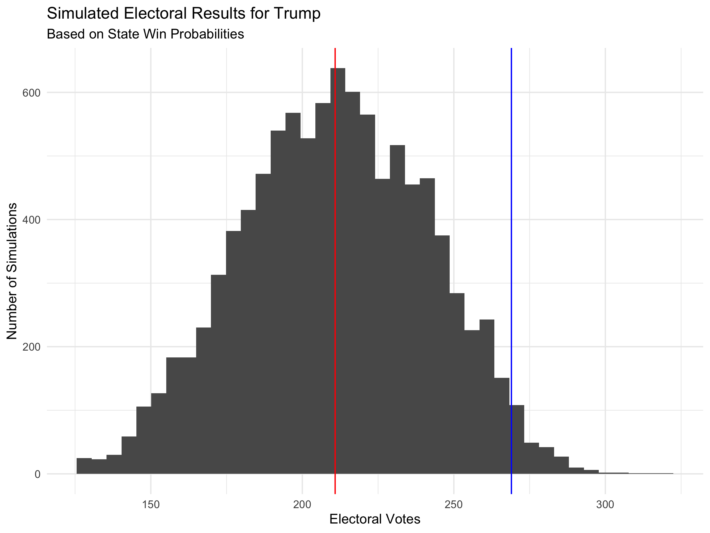

# Final Prediction

11/1/2020

With only days until the 2020 Presidential election, I will be making my final election prediction. In this post I will make a prediction about the two-party vote share in each state, the national two-party vote share, and the 

# Basis for the Prediction

In a previous blog post I considered the effectiveness of polling. I found that state polling data tends to converge very well on the actual two party vote share for the state (and national polling data shows much less of a convergence). For this reason, I am using only state level October and November polling to make the state level vote share prediction. This is consistent with major forecasting models which tend to have polling dominate their model once the election is very close. This strategy makes sense because long before the election there is a lot more uncertainty about how the polls may change before election day so it is necessary to use other, more rigid factors to make the prediction more stable and better account for the uncertainty. Since that polling uncertainty decreases very close to the election, we do not need more variables to have strong predictive power.

As a consequence, the model I am using for this prediction is not the most useful model when trying to predict the election long before election day because, of course, October and November polling data may not be available yet. However, close to the election, this is a reasonable basis for a prediction.

To predict the national two-party vote share, I use the predicted state level two-party vote shares and weight them by the size of their voting eligible populations. Although this method does not account for possible difference in turnout between states, historical data indicates that state level two-party vote shares aggregate to a close estimate of the national two-party vote share despite the possibility of different turnout rates.

To predict the final electoral vote share and map, I will again start with py predicted state-level two-party vote shares. I will generate win odds for Trump in each state by looking at historical data for how often 
I will also use electoral vote share to make an estimate of Donald Trump's win odds by simulating that election 10,000 times

# The Model

## State-Level Two-Party Vote Share

To predict the state level two-party vote share, I perform a linear regression on the relationship between polling in the October and November and the actual two-party vote share in that election.

Now we can use this regression to predict states 

Aggregating these predictions into a map, we get a predicted electoral map of:

## National Two-Party Vote Share

First, consider whether it is reasonable that we use our state-level two-party vote share to predict the 

## Electoral Vote Prediction

I simulated the election 10,000 times using the win probabilities determined by current polling averages and based on historical data on win rates for states with these polling averages.

