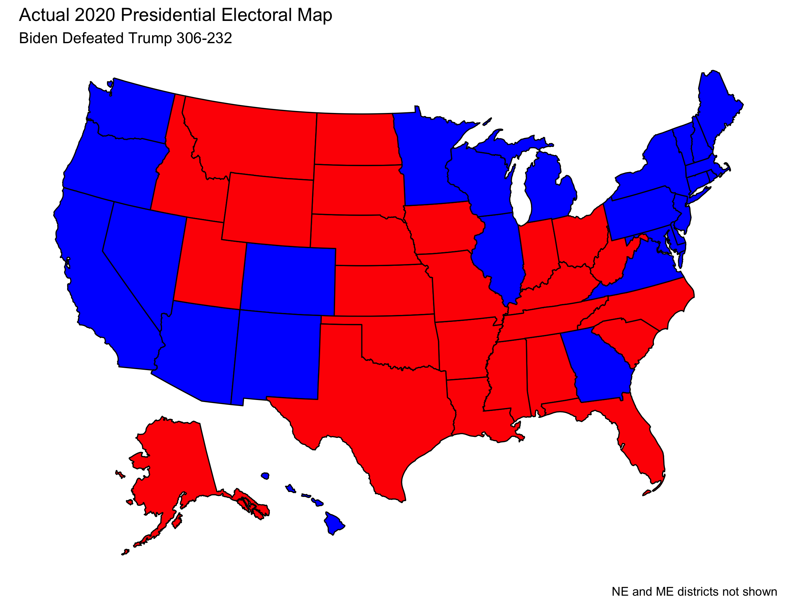
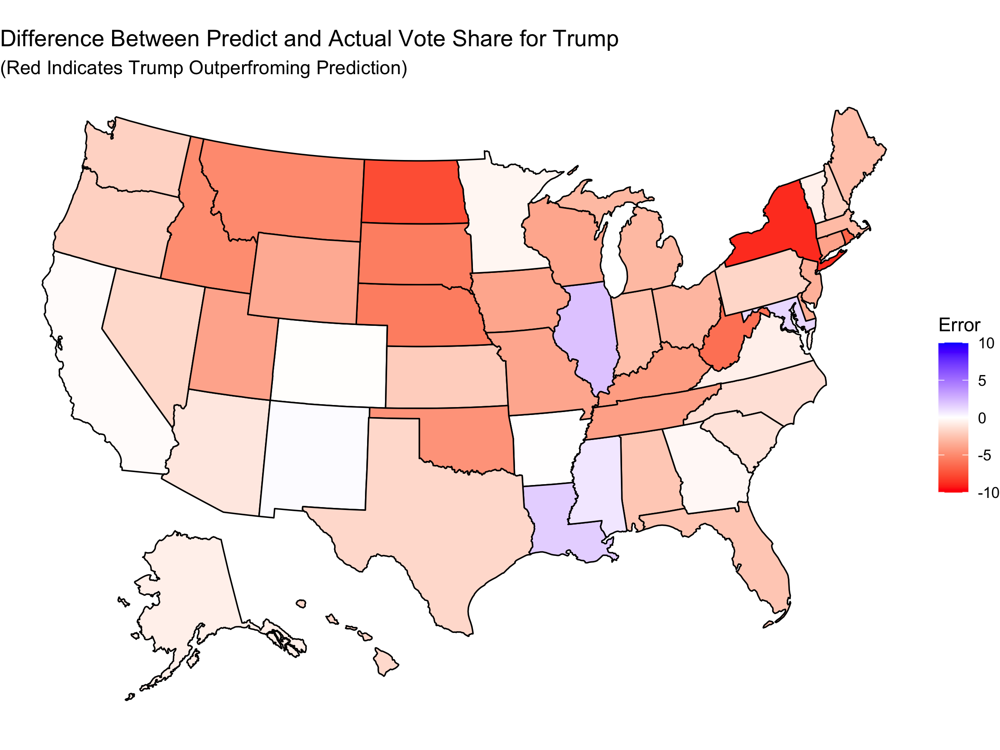
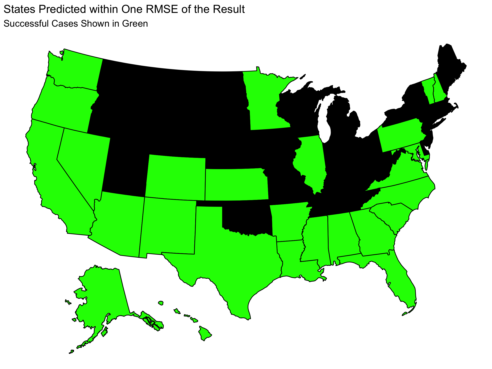
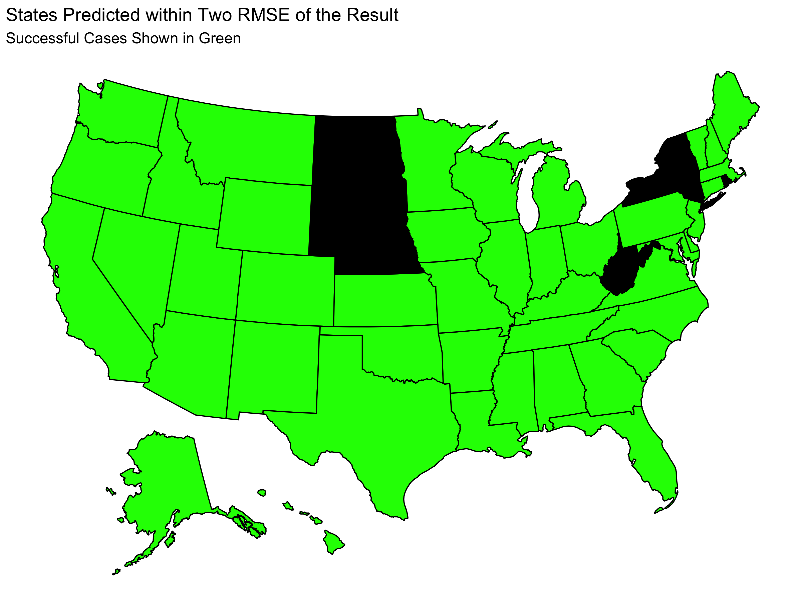
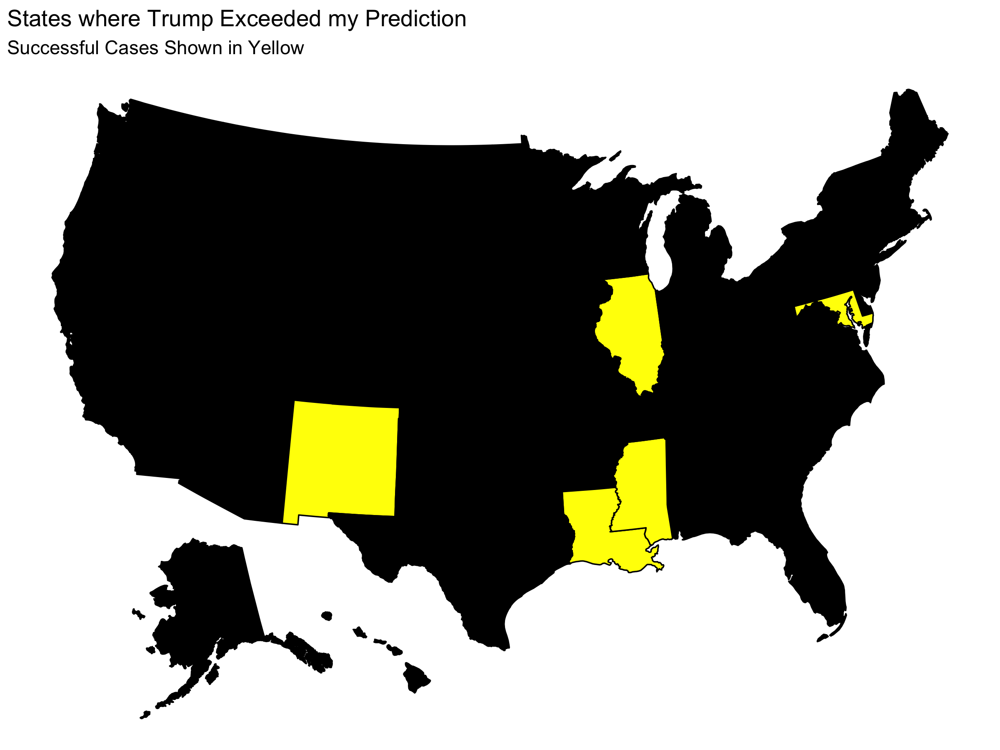

## Reflection

11/23/2020

With the results of the 2020 elections behind us, I can consider how well my [Final Election Prediction](prediction.md) captured the election and how it could have been improved. In this post I recap the results of the 2020 election and summarize the key predictions and methodology of my model. I then move to **reflecting on how well my model matched the results, what caused discrepancies between the two, and how the model could be improved.**

# Election Results

**Joe Biden defeated Donald Trump in the 2020 US presidential election.**

| Candidate | Electoral Votes |
|-----------|-----------------|
| Trump     | 232             |
| Biden     | 306             |

With the electoral map being:

(Note that this visualization does not display the fact that Trump won 1 electoral vote from Maine's 2nd District and that Biden won 1 electoral vote from Nebraska's 2nd District.)

Furthermore, the national two-party vote share for each candidate was 

| Candidate | National Two-Party Vote Share |
|-----------|-------------------------------|
| Trump     | 48%                           |
| Biden     | 52%                           |

# Review of Model

## Restatement of Predictions

**My final election prediction was that Joe Biden was going to win the 2020 US Presidential Election.** You can find my full prediction as well as complete explanations of uncertainty and my methodology in my ["Final Election Prediction"" blog post](prediction.md). 

To summarize the key results, I made two-party popular vote predictions for each state which are listed in the table below:

These state-level predictions yield the following electoral map.

And this electoral map corresponds to an electoral result of:

| Candidate | Electoral Votes |
|-----------|-----------------|
| Trump     | 188             |
| Biden     | 350             |

This electoral result was my final electoral prediction.

Furthermore I predicted that the national two-party vote share would be 

| Candidate | National Two-Party Vote Share |
|-----------|-------------------------------|
| Trump     | 46.1                          |
| Biden     | 53.9                          |

Finally, I simulated the election 10,000 times using win probabilities determined by historical data. **These simulations gave Trump a 2.49% chance of winning the election.**

## Methodology for Prediction

**My model was based entirely on polling and historical data on the accuracy of polling.** I found that there is a strong correlation between polling close to the election and the election result. Thus, I fit a linear regression between the polling average and the actual two-party vote share in past elections. I used that regression line to predict the two party vote shares in each state based on polling in October. The regression line showed a deviation from the y = x line that would indicate perfect predictive power from the polls. This deviation shows that polling tends to overestimate Democrats and underestimate Republicans.

Using the 

# How Did I Do?

## State Level Predictions

I can first consider the 

On each of my state level predictions, there was a RMSE from my model of 2.73. This means that we can get more information about the accuracy of my prediction by considering my uncertainty. Below we can see which states has a difference between predicted and actual results that was within one or two RMSE 

However, looking at RMSE does not consider whether my prediction over or underestimated Trump's two-party vote share. The map below indicates whether I under or overestimated Trump in a given state.

## National Level Predictions

## Win Probability

Since the actual election only happens once, it is difficult to assess how accurate my prediction of Trump having a 2.49% chance of winning. With that said, the fact that Biden won is reassuring because it is consistent with the idea that we should expect Biden to win.

# The Error

My model consistently underestimated Trump's performance. The primary source of this error is presumably the polling error. My model used the fact that Republicans are chronically underestimated in the polls according to historical data. However, that was insufficient to account for the fact that the polls consistently underestimated Donald Trump. I discuss more about the 

The two party vote shares predicted by my model were within one RMSE of the actual values in abut half the states and within two RMSE in most states, which suggests that the error was often within a reasonable margin of error of my point estimate. However the fact that the error in my predictions was consistently in the same direction (underestimating Trump) suggest a systematic, methodological error that causes this discrepancy.

# Plan for Future Improvements

My model ultimately has a large dependency on the polls. In a sense, this means I put all of my eggs in the same basket. **The accuracy of my model was tied incredibly tightly to the success of the polls.** It is likely that it would be wiser for me to include a baseline of fundamental variables (such as incumbency) to make my model more robust to small changes in the polling averages.

**In the context of the coronavirus pandemic, I had made the choice to neglect many of the predictive variables that are traditionally used.** In particular, I suspected that historical trends in the impact of economic variables would break down given the record numbers and I suspected that any sort incumbency party advantage would also be confounded by the virus. This led me to lean more on the polling.

I still believe that the principle of weighting the polls heavily (even if less than in my model) is not necessarily a poor decision, given that the **polls offer a direct lens in which to capture public opinion.** This prompts me to consider how I can still lean on the polls without doing too much to tie my fate to the fate of the polls.

In order to keep a high level of dependence on the polls in a reasonable, it can become more **important to consider how the polling accuracy have changed over the years** (comparing between different election cycles). In my model I found that **on average the polls tend to underestimate the performance of the Republican party.** However, this effect may be more (or less) pronounced as a function of recency or when conditioned on other variables (like incumbency) which may generate a better model.

I could test this hypothesis by re-generating my model but restricting the polling data I look at either only recent elections or to look at elections with an incumbent running for re-election. I could then see which iteration of my model has the best in and out of sample fit. The difficulty in testing the relative quality of these models, however, comes from the fact that **these variations require using smaller data sets. This means that there are fewer elections to which these models are applicable which makes it more likely that they are over-fit to a hyper-specific subset of elections.** It is difficult to distinguish between a model with a strong ability to predict and a model that is over-fit.

Alternatively I could hedge my bets with 

# Methodological Considerations

Since I used a linear regression model to make my predictions about the two-party vote share in each state, it was possible that my prediction in a given states be impossibly high (>100%) or impossibly low (<0%). In principle this poses an issue for my model because I would need to either manually prevent such a prediction, or I need to accept that I may make unreasonable predictions.

However, **I still think that the linear regression was a reasonable choice.** The way my model was constructed started with a polling average, which must be from 0-100, and gave a correction due to historical trends. **The magnitude of the correction was much smaller than the proximity of polling averages to 0 and 100.** This means that the impossible predictions remain an unlikely edge case. If I were -however- to make changes to the model that allows for larger corrections to the polling averages, this is more likely to become a relevant issue as the probability of getting an impossible prediction increases. (If polling averages tended to be more toward the extremes I would have the same issue with the same correction term, but in that case I could still make strong electoral predictions by simply claiming that these states have a very predictable outcomes.) 

Additionally, I could add considerations to the relatedness of different states. The results of different states tend to be correlated. For example, clusters of states in the Midwest 
Since my 
Ignoring correlation has both pros and cons. 

Another time I would also explicitly predict the districts in Maine and Nebraska

Finally, my model also has the drawback of requiring that polling data from shortly before the election be available. Since I use October polling data to make the prediction, before this data is available

# Conclusion

My model correctly predicted that Joe Biden would win. My national two-party popular vote prediction was within one RMSE of capturing the actual national two-party popular vote share. And my model correctly predicted the winning candidate in 48 states and the District of Columbia. 

**These accuracies seem to suggest that my model was reasonably effective. However, with a lack of robustness due to heavy dependence on polling accuracy and a consistent underestimation of Trump's two party vote share in each state, it seems that my model does not capture the election exceptionally well.**
