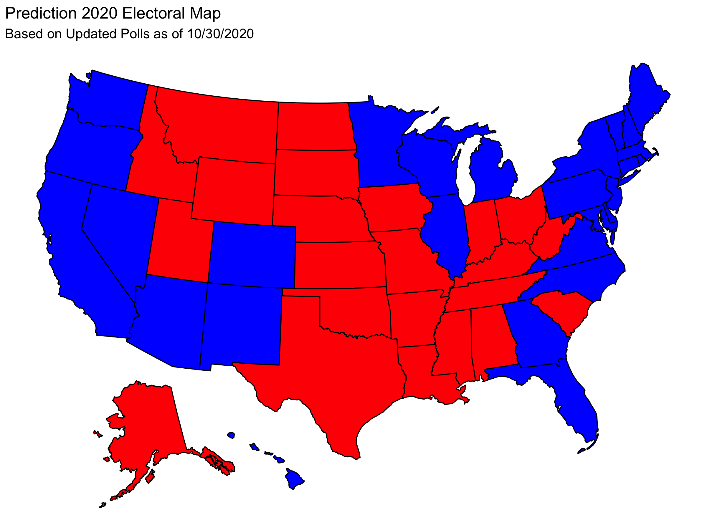

## Reflection

11/23/2020

With the results of the 2020 elections behind us, I can consider how well my [Final Election Prediction](prediction.md) captured the election and how it could have been improved. In this post I recap the results of the 2020 election and summarize the key predictions and methodology of my model. I then move to **reflecting on how well my model matched the results, what caused discrepancies between the two, and how the model could be improved.**

# Election Results

**Joe Biden defeated Donald Trump in the 2020 US presidential election.**

| Candidate | Electoral Votes |
|-----------|-----------------|
| Trump     | 232             |
| Biden     | 306             |

With the electoral map being:

(Note that this visualization does not display the fact that Trump won 1 electoral vote from Maine's 2nd District and that Biden won 1 electoral vote from Nebraska's 2nd District.)

Furthermore, the national two-party vote share for each candidate was 

| Candidate | National Two-Party Vote Share |
|-----------|-------------------------------|
| Trump     | 48%                           |
| Biden     | 52%                           |

# Review of Model

## Restatement of Predictions

**My final election prediction was that Joe Biden was going to win the 2020 US Presidential Election.** You can find my full prediction as well as complete explanations of uncertainty and my methodology in my ["Final Election Prediction" blog post](prediction.md). 

To summarize the key results, I made two-party popular vote predictions for each state which are listed in the table below:

These state-level predictions yield the following electoral map.

And this electoral map corresponds to an electoral result of:

| Candidate | Electoral Votes |
|-----------|-----------------|
| Trump     | 188             |
| Biden     | 350             |

This electoral result was my final electoral prediction.

Furthermore I predicted that the national two-party vote share would be 

| Candidate | National Two-Party Vote Share |
|-----------|-------------------------------|
| Trump     | 46.1                          |
| Biden     | 53.9                          |

Finally, I simulated the election 10,000 times using win probabilities determined by historical data. **These simulations gave Trump a 2.49% chance of winning the election.**

## Methodology for Prediction

**My model was based entirely on polling and historical data on the accuracy of polling.** I found that there is a strong correlation between polling close to the election and the election result. Thus, I fit a linear regression between the polling average and the actual two-party vote share in past elections. I used that regression line to predict the two party vote shares in each state based on polling in October. The regression line showed a deviation from the y = x line that would indicate perfect predictive power from the polls. This deviation shows that **polling tends to overestimate Democrats and underestimate Republicans.**

Using the state-level two party vote share predictions, I made a national two party vote prediction by weighting the state level predictions by the size of their voting eligible populations (VEPs). Historical data indicated that this was a strong predictor even though turnout may be different across states.

Finally, my simulation of the election used the historical win rate for Republicans when they poll in certain intervals. This gave me a win probability in each state which I treated as independent in 10,000 simulations.

# How Did I Do?

## State Level Predictions

I can first consider the difference between what I predicted and the actual result in each state (in terms of two-party vote share). This gives the map:

We can see that Trump tended to perform better than I predicted him to. Here is a map showing the handful of states in which Trump did worse than my prediction:

Whether my predictions over or underestimated Trump does not tell the whole story. **Each point estimate also had uncertainty.** This means that we can get more information about the accuracy of my prediction by considering my uncertainty and not simply the point estimate. On each of my state level predictions, there was a RMSE from my model of 2.73 as found by an out of sample fit test (leave one out validation). Below we can see which states have a difference between predicted and actual results that was within one or two RMSE: 

Here we see that **almost all states had actual results within two RMSE of my prediction and that about half of the states had actual results within one RMSE of my prediction.** Considering the size of the RMSE (2.73), this indicates that my predictions did not have a lot of precision at capturing the actual result.

## National Level Predictions

### Root Mean Squared Error

Root Mean Squared Error (RMSE) is a measure of the accuracy of a prediction found by square rooting the sum the squares of the difference between the actual and predicted values.

***RMSE  = (Σ(prediction - actual)^2)^.5***

In this case, I can sum over the predictions I made in each state. **I find that I have a RMSE of 24.5.** This is *fairly large* indicating that the accuracy of my model was unexceptional. This is consistent with what I found above looking state by state in how there were a number of states in which my predictions were not close to the actual result.

### Brier Score

I can also consider the quality of my prediction using a Brier Score. The Brier Score is defined as

***Brier Score = 1/N * Σ(probability - outcome)^2***

where N is the number of predictions (in this case 51), "probability" is the win odds I assign to a particular candidate (from 0 to 1), and the outcome is 1 if the candidate won and 0 otherwise.

I did not generate state-level win probabilities, but I did make predictions for the winner in each state. If we take our probabilities to be 1 or 0 depending on my predicted winner, we can calculate a Brier Score. 

Below is a map that shows which states I predicted the winner of correctly.

We can see that I correctly predicted 48 states and the District of Columbia. I predicted the wrong winner only in Florida and North Carolina. Using this, **I find that I have a Brier Score of 0.0392.** Considering that giving equal win probabilities to each candidate in each state gives a Brier Score of 0.25. *This is a low Brier Score which suggests that my model was successful.*

The contrast between my low Brier Score and high RMSE indicates that my point estimates were inaccurate, but they did not tend to be inaccurate in a way that changed which candidate would win. In this sense, the RMSE indicates that my low Brier Score does not mean that my point estimates were especially good.

### National Popular Vote

I had predicted that Trump would get 46.1% of the national two-party popular vote. Trump actually got 48% of the national two-party popular vote. My prediction had a RMSE of 2.73. This means that my predicted two-party popular vote share was within one RMSE of the actual value. In other words, **my national two-party vote share was within a reasonable margin of error from the actual national two-party vote share.**

## Win Probability

Since the actual election only happens once, it is difficult to assess how accurate my prediction of Trump having a 2.49% chance of winning was. With that said, the fact that Biden won is reassuring because it is consistent with the idea that we should expect Biden to win.

# Error and Hypotheses

**My model consistently underestimated Trump's performance.** The primary source of this error is presumably the polling error. My model used the fact that Republicans are chronically underestimated in the polls according to historical data. However, that was insufficient to account for the fact that the polls consistently underestimated Donald Trump. I hypothesize that this could be caused by an increase in the politicization of the polls. Republicans may have been particularly disillusioned with the polls in 2016 where Clinton was projected to win comfortably. In order to investigate this we would need to collect data on people's opinion of the polls based on their political leanings. Or we could attempt to account for a shift in the polling accuracy by fitting the regression of my model to only more recent elections in which we would expect this polarization and politicization to have taken effect.

On a different note, the two party vote shares predicted by my model were within one RMSE of the actual values in abut half the states and within two RMSE in most states, which suggests that the error was often within a reasonable margin of error of my point estimate despite the fact that I did not have a lot of precision. **However the fact that the error in my predictions was consistently in the same direction (underestimating Trump) suggests a systematic, methodological error that causes this discrepancy.**

## Dependence on Polling

My model ultimately has a large dependency on the polls. In a sense, this means I put all of my eggs in the same basket. **The accuracy of my model was tied incredibly tightly to the success of the polls.** It is likely that it would be wiser for me to include a baseline of fundamental variables (such as incumbency) to make my model more robust to small changes in the polling averages.

**In the context of the coronavirus pandemic, I had made the choice to neglect many of the predictive variables that are traditionally used.** In particular, I suspected that historical trends in the impact of economic variables would break down given the record economic numbers and I suspected that any sort incumbency party advantage would also be confounded by the virus. This led me to lean more on the polling.

I still believe that the principle of weighting the polls heavily is not necessarily a poor decision, given that the **polls offer a direct lens in which to capture public opinion.** This prompts me to consider how I can still lean on the polls without doing too much to tie my model's fate to the fate of the polls.

In order to keep a high level of dependence on the polls in a reasonable way, it can become more **important to consider how the polling accuracy have changed over the years** (comparing between different election cycles). In my model I found that **on average the polls tend to underestimate the performance of the Republican party.** However, as mentioned in the above section, this effect may be more pronounced as a function of recency. Alternatively it may depend on other variables, like incumbency, which would then be required to generate a better model.

I could test these hypotheses by re-generating my model but restricting the polling data I look at either only to recent elections or to look at elections with an incumbent running for re-election. I could then see which iteration of my model has the best in and out of sample fit. The difficulty in testing the relative quality of these models, however, comes from the fact that **these variations require using smaller data sets. This means that there are fewer elections to which these models are applicable which makes it more likely that they are over-fit to a hyper-specific subset of elections.** It is difficult to distinguish between a model with a strong ability to predict and a model that is over-fit.

# Methodological Considerations and Future Improvements

## Linear Regression 

Since I used a linear regression model to make my predictions about the two-party vote share in each state, it was possible that my prediction in a given states be impossibly high (>100%) or impossibly low (<0%). Although this did not happen, in principle this poses an issue for my model because I would need to either manually prevent such a prediction, or I need to accept that I may make unreasonable predictions.

However, **I still think that the linear regression was a reasonable choice.** My model was constructed started with a polling average, which must be from 0-100, and gave a correction due to historical trends. **The magnitude of the correction was much smaller than the proximity of polling averages to 0 and 100.** This means that the impossible predictions remain an unlikely edge case. If I were, however, to make changes to the model that allows for larger corrections to the polling averages, this is more likely to become a relevant issue as the probability of getting an impossible prediction increases. 

(If polling averages tended to be more toward the extremes I would have the same issue even with the same small correction term, but in that case I could still make strong electoral predictions by simply claiming that these states have very predictable outcomes.) 

## Correlations Between States

I could add considerations to the relatedness of different states. The results of different states tend to be correlated. For example, clusters of states in the Midwest are likely to vote the same way. **This means that my simulations, which treated each state as having independent probabilities, does not actually capture the way states behave.** With that said, accurately determining these correlations may be difficult and introduce uncertainty. In that sense, omitting this variable allowed me to avoid this soure of error, which likely cost me some precision, particularly in the win probabilities I gave to each candidate. 

I could investigate this by re-running the simulations with the outcomes of different states being related and analyzing whether this drastically changed Trump's win probability. This is not the most important thing to inspect considering that I don't have a great way to assess what Trump's win probability actually was.

## District Predictions

**My forecast should explicitly predict the districts in Maine and Nebraska (which allocate their own electoral votes).** My prediction only considered state wide polling. This means that I had no ability to predict a district voting different than the overall state. The districts could shift my prediction and, in a case of a close election, this could make a difference in the result. In order to incorporate these into my model I would need to see if districts adhere closely to the regression line I found. This may be difficult as we have less data on the voting behavior of these districts as opposed to whole states.

## Key Limitation of Model

My model also has the significant drawback of requiring that polling data from shortly before the election be available. Since I use October polling data to make the prediction, before this data is available my model is not applicable; you would need to use the most recent polling as a proxy, but this greatly compromises the predictive power since the regression line is specifically October polling data.

# Conclusion

My model correctly predicted that Joe Biden would win. My national two-party popular vote prediction was within one RMSE of capturing the actual national two-party popular vote share. And my model correctly predicted the winning candidate in 48 states and the District of Columbia giving it a Brier score of .0392. 

**These accurate predictions seem to suggest that my model was reasonably effective. However, with a lack of robustness due to heavy dependence on polling accuracy, a consistent underestimation of Trump's two party vote share in each state, and a large RMSE, it seems that my model does not capture the election exceptionally well.**
