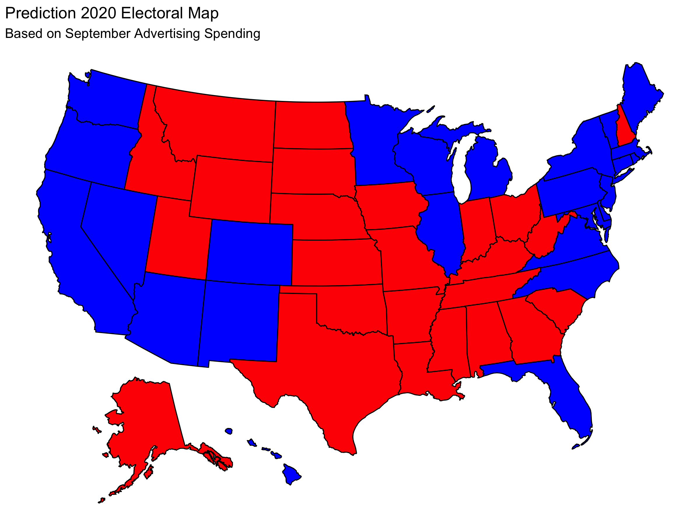
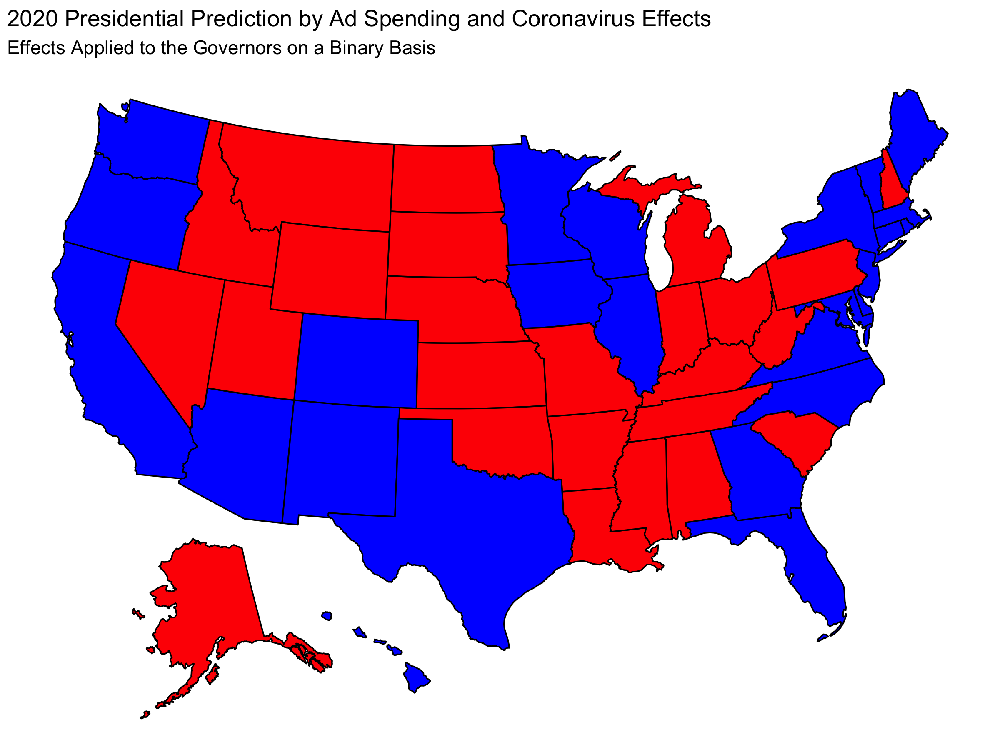
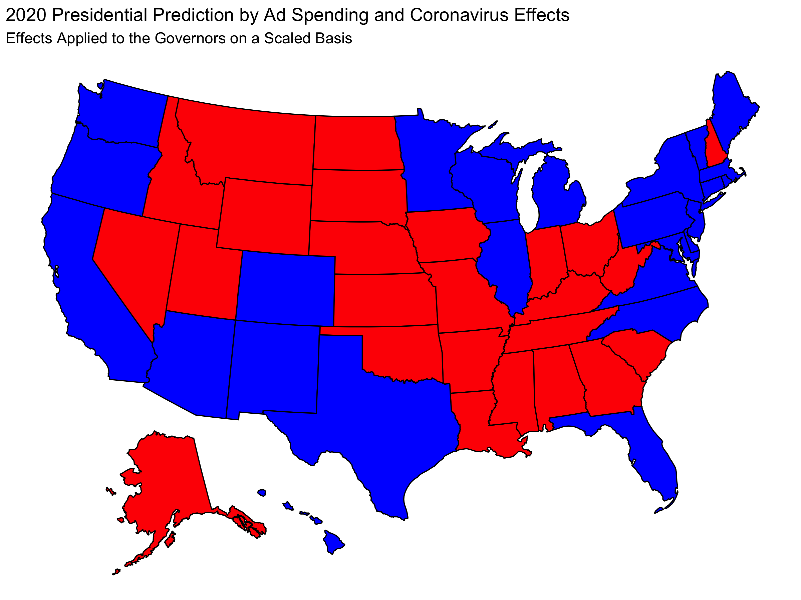
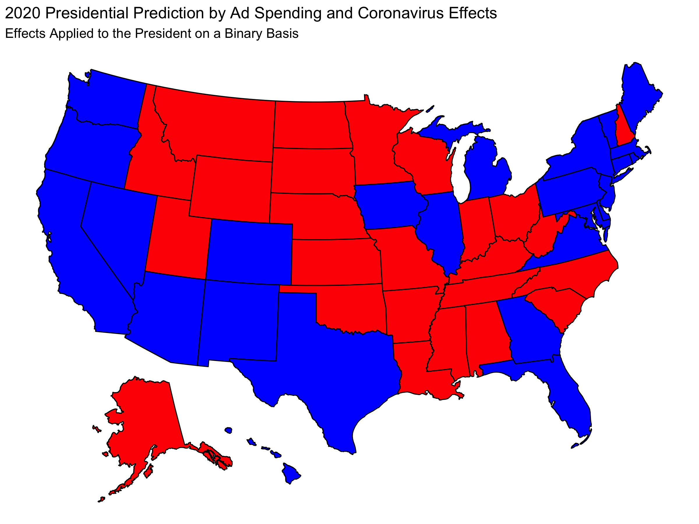
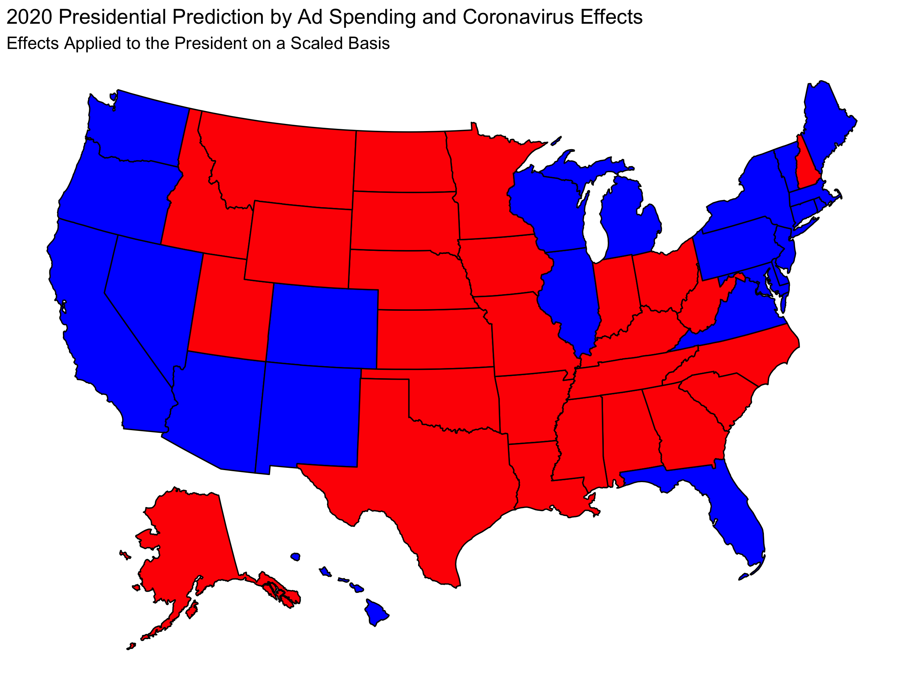

## Shocks: Covid-19

In this post we will consider how "shocks" can influence an election. A shock is an unforeseen event that can has the potential to influence the election. For the 2020 election cycle, the clearest example of a "shock" is Covid-19. In this post I will consider how the deaths due to coronavirus could impact the result of the 2020 presidential election.

In my previous post about the [air game](air_game.md), I made a state by state prediction based on **ad spending by the two major parties in the month of September** and whether states are **battleground states**. I will consider how **this prediction can be modified** by adjusting for the effect of coronavirus. For convenience, here is the prediction that was made in that previous blog post:

In total I will consider 4 total possible new predictions depending on whether blame/credit for Covid-19 handling is given to the President or the Governor and whether success should be a binary variable or a spectrum.

# Predictability

It is difficult to assign a weight to the effect of Coronavirus in terms of influencing how voters behave. There are a number of relevant considerations:

1. Do voters attribute blame for the Coronavirus to politicians and poltical parties?
2. Do voters associate the handling of Coronavirus more with Donald Trump and the Republican party, or with their Governor and therefore the party of their Governor?
3. How does the magnitude of the effect of Coronavirus compare to the the two-party voting percentages predicted from ad spending?
  
It is difficult to make absolute declarations about the answers to these questions. For that reason I will consider how we'd expect the result of the election to look in a number of different scenarios based on these questions. 

First, for this post I will assume that the answer to the first questions is yes, that **voters do blame politicians for the effects of coronavirus**. In the case where the answer to this question is no, we would expect the prediction to default to [my previous prediction](air_game.md) so I would not need to change the prediction.

I will separately consider the two possible answers to the second question. I will make predictions both with the assumption that **credit or blame is assigned to Trump specifically** and with the assumption that **credit or blame is given to the party of the governor** of the state.

I will also consider two possible answers to the third question, which I will discuss below.

# Relative Performance

Data suggests that people tend to judge response to crisis on a **relative scale**. This means that we need to assess effectiveness of coronavirus response **relative to other states**. 

With that lens, there are two ways we can interpret how people assess how well their state is doing in terms of dealing with Covid-19. First, we can have a binary variable that **classifies each state as a "success" or a "failure"** with respect to the coronavirus based on the number of deaths per capita in the state. Second, we can have a variable that scales the effect of coronavirus with varying degrees of "success" and "failure". I will consider both of these cases.

Since Covid-19 is a shock, I am going to make the assumption that the **magnitude of its impact is very large**. This means that in the case of the binary success/failure model, I'm assuming the change in two-party popular vote share is enough to change the result in a state and in the varying success/failure model I am assuming that "success" in handling Covid-19 gives a **benefit of 5% increase in two-party vote share** and that "failure" has a **cost of 5% decrease in two-party vote share**. 

## For Clarity:

In the case of varying degree of success, the best and worst states will see these 5% changes and **intermediate states will see intermediate changes**. In the case of the binary success/failure metric, half of the states will be deemed successes and half will be deemed failures.

Success and failure in terms of Covid-19 is measured by deaths per capita in each state compared to the other states.

# Battleground Assumption

As with my previous model, I am not going to adjust predictions about "safe states". Since "safe states" are by definition not likely to have an volatility in result, we can responable make the assumption that the effect of different variables in the election cycle, including shocks like **Covid-19, will not change the result in those states**. Thus, I will only update predictions in the battleground states: NH, TX, IA, MI, MN, WI, PA, FL, AZ, NV, NC, GA, and OH.

# Blaming the Governor

The "Blaming the Governor" model is likely a reasonable assumption. People have shown that they are able to distinguish between the behavior of their Governor and of the President. This means that the effect on the presidential election will not be tied to the party of the state's governor.

In the case where half the states are successes and half are failures, my updated prediction is:

| Candidate             | Electoral Votes 
|-----------------------|-----------------
| Trump                 | 190             
| Biden                 | 348    

In the case where states are assigned scaled degrees of success and failure, my updated prediction is:

| Candidate             | Electoral Votes 
|-----------------------|-----------------
| Trump                 | 176             
| Biden                 | 362    

# Blaming the President

Since we are considering a Presidential election, it is fitting to attribute the responsibility of Coronavirus to the president.

In the case where half the states are successes and half are failures, my updated prediction is:

| Candidate             | Electoral Votes 
|-----------------------|-----------------
| Trump                 | 183             
| Biden                 | 355    

In the case where states are assigned scaled degrees of success and failure, my updated prediction is:

| Candidate             | Electoral Votes 
|-----------------------|-----------------
| Trump                 | 233             
| Biden                 | 305    

# Analysis and Reflection

Seeing the predictions in each of the four cases we can reflect on which map(s) seem the most plausible. 

In 2016, Trump won most of the Midwest battleground states, but he did not win Minnesota. For this reason, the "Blame the governor" models seem to make sense because they show that **Biden would lose Midwest states other than MN more readily than MN** which is consistent with the 2016 election. Furthermore, predicting that Biden wins Texas (and Georgia in one case) is ambitious. Other models tend to claim that Texas voting for Biden is likely correlated with Biden winning many states that Trump won previously. For this reason, **the scaled "blame the governor" model seems more reasonable than the binary model**.

For the "blame the president" models, it is odd that Biden would lose MN but win other Midwest states, especially Iowa which polling suggests is less likely to vote blue than other Midwest states. However, if we push back on the assumption that MN is more likely to vote for Biden than other Midwest states, the result of the **scaled "blame the president" model seems fairly reasonable** since it does not require Biden to win many states that Trump won previously.

